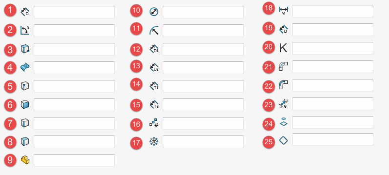

All generated controls have common properties which can be customized

1. Control icon selected from the standard library of icons
1. Custom control icon loaded from the image
1. Tooltip of the control displayed on mouse hovering

## Style

Common styles can be customized via [ControlOptionsAttribute](https://docs.codestack.net/swex/pmpage/html/T_CodeStack_SwEx_PMPage_Attributes_ControlOptionsAttribute.htm) by decorating the specific properties in data model.

This attribute allows to define the alignment, position, size as well as background and foreground colours:



## Attribution

### Tooltip

Tooltip for controls can be set by applying the [DescriptionAttribute](https://docs.microsoft.com/en-us/dotnet/api/system.componentmodel.descriptionattribute?view=netframework-4.0)

### Standard Icon

Standard icon defined in [swControlBitmapLabelType_e](https://help.solidworks.com/2017/english/api/swconst/SolidWorks.Interop.swconst~SolidWorks.Interop.swconst.swControlBitmapLabelType_e.html?id=aff2422a1ecf4632aae3e41abe59c6fc) enumeration can be set to control via [ControlAttributionAttribute](https://docs.codestack.net/swex/pmpage/html/M_CodeStack_SwEx_PMPage_Attributes_ControlAttributionAttribute__ctor.htm) attribute.



Use the below map of all available standard icons:

1. swBitmapLabel_LinearDistance
1. swBitmapLabel_AngularDistance
1. swBitmapLabel_SelectEdgeFaceVertex
1. swBitmapLabel_SelectFaceSurface
1. swBitmapLabel_SelectVertex
1. swBitmapLabel_SelectFace
1. swBitmapLabel_SelectEdge
1. swBitmapLabel_SelectFaceEdge
1. swBitmapLabel_SelectComponent
1. swBitmapLabel_Diameter
1. swBitmapLabel_Radius
1. swBitmapLabel_LinearDistance1
1. swBitmapLabel_LinearDistance2
1. swBitmapLabel_Thickness1
1. swBitmapLabel_Thickness2
1. swBitmapLabel_LinearPattern
1. swBitmapLabel_CircularPattern
1. swBitmapLabel_Width
1. swBitmapLabel_Depth
1. swBitmapLabel_KFactor
1. swBitmapLabel_BendAllowance
1. swBitmapLabel_BendDeduction
1. swBitmapLabel_RipGap
1. swBitmapLabel_SelectProfile
1. swBitmapLabel_SelectBoundary

### Custom Icon

Custom icon can be set via overloaded constructor of [ControlAttributionAttribute](https://docs.codestack.net/swex/pmpage/html/M_CodeStack_SwEx_PMPage_Attributes_ControlAttributionAttribute__ctor_1.htm) attribute



Second version of the [overloaded constructor](https://docs.codestack.net/swex/pmpage/html/M_CodeStack_SwEx_PMPage_Attributes_ControlAttributionAttribute__ctor_2.htm) allows to specify the transparency mask through shades of grey with boundaries of black pixels = 100% opaque and white pixels = 100% transparent. If first version of constructor is used mask will be generated automatically based on the transparency (Alpha channel of the image).