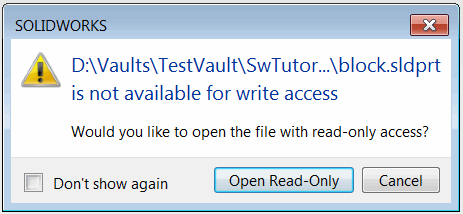

When file which is checked-in to SOLIDWORKS PDM vault is opened in SOLIDWORKS it will be accessed with read-only access

The corresponding state is displayed next to the file name.

If standard SOLIDWORKS PDM add-in is used this file can be automatically checked out for editing without the need to close the file. However calling the [IEdmFile5::LockFile](https://help.solidworks.com/2014/english/api/epdmapi/EPDM.Interop.epdm~EPDM.Interop.epdm.IEdmFile5~LockFile.html) SOLIDWORKS PDM API for this scenario would result in the following COM exception.

> -2147220981: An attempt was made to access a file that is exclusively opened by another application.

SOLIDWORKS API provides methods to temporarily release lock for the active document so it can be updated or changed by other applications. The model can be later reloaded with changes applied. This technique allows to have model information and visual data to stay loaded in SOLIDWORKS while file is being edited by other applications.

The following macro will demonstrate this technique and will check-out currently opened checked-in (read-only) file in SOLIDWORKS application.

Modify the value of the *VAULT_NAME* variable to the corresponding vault name where the active model has been opened from.


