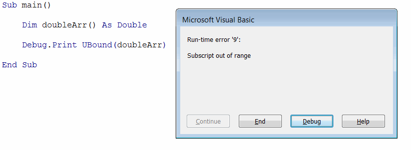

Visual Basic array is a set of elements which is stored in the single variable and can be accessed by index.

In order to declare array it is required to append the variable name with parenthesis () symbol;

~~~ vb
Dim arr() As Double 'declaring the array of doubles
~~~

Array elements can be accessed by the index

~~~ vb
Dim arr(2) As String
Dim elem As String
elem = arr(0) 'getting first element
~~~

## Initializing arrays in Visual Basic

Arrays is a set of the fixed size. Size can be assigned while declaration.

~~~ vb
Dim arr(2) As Double 'declaring the array of 3 doubles (from 0 to 1)
~~~

> The single number between the parenthesis represents the upper boundary of the array. By default arrays are 0-based. So specifying (5) as array size means that there will be 6 elements in the array.

It is possible to explicitly specify the upper and inner boundaries of the array

~~~ vb
Dim arr(1 To 5) As Double 'declaring the array of 5 doubles (from 1 to 5)
~~~

> It is recommended to use 0-based array as it is a common practice across different programming languages.

Array elements can be accessed and changed by their index. If specified index is outside of the boundaries of the array, run-time error is raised.

In some cases size of the array cannot be known at the compile time and it will be identified during the run-time. In this case array can be declared without the size (i.e. not initialized). Such array can be then resized dynamically using the **ReDim** keyword.

~~~ vb
Dim arr() As Double
ReDim arr(2) 'initializing the size of the array
~~~

In order to retrieve the upper and lower boundaries of the array **UBound** and **LBound** can be used respectively.

> UBound function cannot be used to identify if the array is initialized as it will throw an exception when used on not initialized array. Use the **IsArrayInitialized** function from the example below to safely identify the state of the array.

{ width=350 }



## Filling array with data

Array elements can be treated as individual variables and the same rules of reading and editing the data applies to array elements as any other variable. Refer [Variables](visual-basic/variables) article for more information.

~~~ vb
Dim arr(2) As Double
arr(<INDEX>) = 10 'changing the value of the variable at <INDEX>
Debug.Print arr(<INDEX>) 'reading the value of the variable at <INDEX>
~~~



## Resizing array

Array size can be changed at run-time. But that can only be done for the array whose size was not explicitly specified on declaration

~~~ vb
Dim arrCanResize() As Integer 'size of this array can be resized
Dim arrCannotResize(3) As Integer 'size of this array cannot be resized
~~~

Attempt of resizing the already dimensioned array will result in the compile error:

{ width=350 }

### Clearing the existing values

**ReDim** keyword allows to resize the array. In this case all existing values will be cleared.



### Preserving existing values

In order to keep the existing values of the array it is required to use **ReDim Preserve** keyword.



### Resizing arrays dynamically

In some cases it might be unknown in advance the size of the array or when the first item (if any) will be added.

In this cases it is beneficial to only init array when needed. It is possible to use the following statement to identify if the array is not initialized `(Not array) = -1` and init with a first item or dynamically resize preserving the existing values.



## Two dimensional array

Two-dimensional array allows to store the table data and can be declared in the following format

~~~ vb
Dim table(<ROWS COUNT>, <COLUMNS COUNT>) As String
~~~

> 2-dimensional array can be resized, but if it is required to preserve the values only second (column) dimension can be resized.



