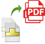

{ width=200 }

这个使用VB.NET开发的控制台应用程序可以使用SOLIDWORKS eDrawings的免费版本通过其API将SOLIDWORKS、DXF和DWG文件导出为PDF。使用此工具不需要安装SOLIDWORKS或使用其许可证。此工具支持Windows 8.1及以上版本。

此功能已集成到[xPort](https://cadplus.xarial.com/xport/)实用程序中。

## 运行工具

此应用程序可以从命令行运行，并期望以下2个必填参数和一个可选参数：

1. 输入文件或文件夹的完整路径（在这种情况下，将导出与过滤器匹配的所有文件）
2. 过滤器。使用*表示所有文件。或者使用*.slddrw表示所有SOLIDWORKS绘图文件
3. （可选）保存PDF文件的输出文件夹。如果未指定，PDF文件将被创建在与输入SOLIDWORKS文件相同的文件夹中。如果文件夹不存在，将自动创建。

## 示例命令

* 将*C:\SOLIDWORKS Drawings*文件夹中的所有slddrw文件（包括子文件夹）导出到与源文件相同的位置

~~~
> exportpdf.exe "C:\SOLIDWORKS Drawings" "*.slddrw"
~~~

* 将*C:\SOLIDWORKS Drawings*文件夹（包括子文件夹）中以*print_*开头的所有SOLIDWORKS绘图文件导出到*C:\PDFs*目录

~~~
> exportpdf.exe "C:\SOLIDWORKS Drawings" "print_*.slddrw" "C:\PDFs"
~~~

## 结果

操作进度将显示在控制台窗口中

{ width=450 }

根据设置创建PDF文件。PDF文件的名称与生成它们的源文件相同。

{ width=450 }

## EDrawingsHost.vb



## Module1.vb



源代码可在[GitHub](https://github.com/codestackdev/solidworks-api-examples/tree/master/edrawings-api/BatchExportPdf)上找到。