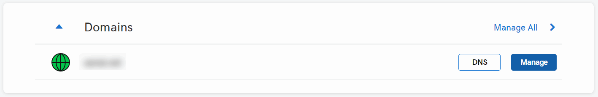
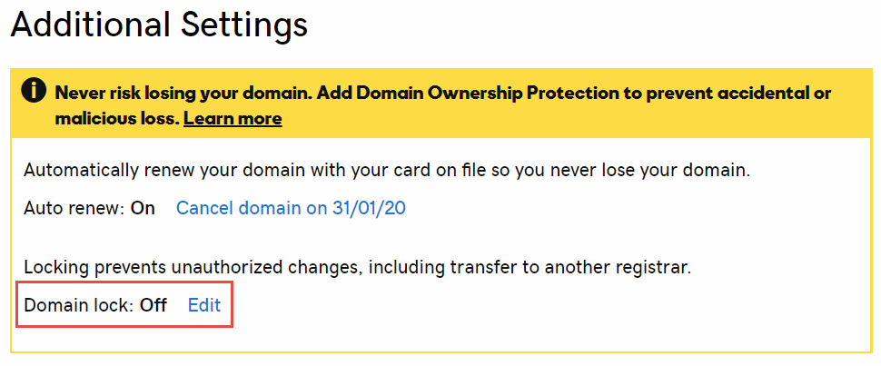
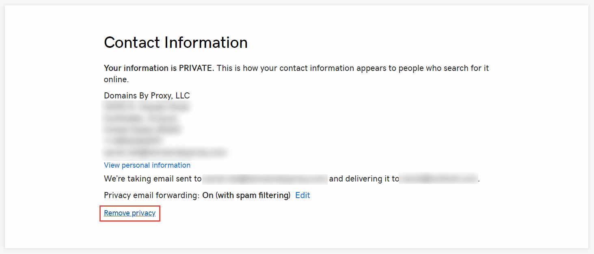
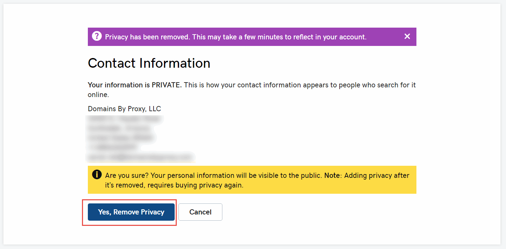
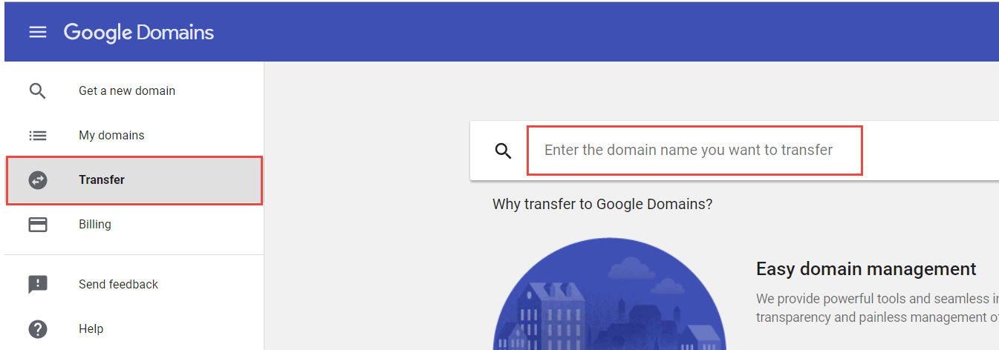
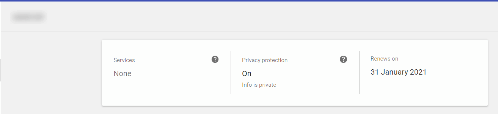

本文是一份详细的逐步指南，教你如何将域名主机从GoDaddy转移到Google Domains。转移域名注册商的原因可能有很多，包括价格、安全性、隐私功能、灵活性、特别优惠、托管选项等等。

Google Hosting相比GoDaddy Hosting的一些优势包括：

* 免费的主机隐私保护
* 免费电子邮件转发服务的电子邮件加密功能

## 在GoDaddy解锁账户

域名转移应该从GoDaddy网站上发起。

登录网站，点击要转移的域名的*管理*按钮。

向下滚动到*附加设置*部分，关闭*域名锁定*功能。

如果你在GoDaddy启用了隐私保护功能，在转移之前必须将其关闭。稍后可以在Google Domains中重新激活。

这个过程可能需要几分钟时间来禁用该功能。

> 如果隐私功能没有关闭，域名转移将无法完成，Google Domains页面上将显示“转移被拒绝，请咨询当前注册商了解更多信息”的消息。

点击*获取授权代码*按钮生成临时令牌，需要将其粘贴到Google Domains中以授权转移。令牌将发送到在GoDaddy注册的电子邮件地址。

{ width=250 }

> 建议在转移之前生成此令牌，因为它可能会过期，导致转移过程失败。

## 启动转移到Google Domains的转移

登录Google Domains，激活*转移*选项卡，搜索要转移的域名（即在上一步中解锁的域名）。

在搜索栏上按Enter键，按照向导执行转移操作。确保第一步中显示了“[域名]已解锁并准备好转移”的消息。粘贴从上一步骤中通过电子邮件发送的授权令牌。

在下一步中，根据之前的设置指定要转移的选项（如DNS记录）。你可能想使用默认选择。

{ width=350 }

在接下来的步骤中配置隐私和自动续订选项。

{ width=450 }

填写购买表单以完成转移。

> 注意，需要提前支付一年的域名维护费用才能执行转移。但是，现有的注册期限将被保留。例如，如果域名在1年后到期（例如2020年1月），将其转移到Google Domains将延长一年（例如2021年1月）。

{ width=450 }

购买获得批准后，域名将等待GoDaddy的批准以完成转移。

## 完成转移

你将收到来自GoDaddy的有关转移的电子邮件，转移将在几个工作日内自动完成。但是，你也可以加快流程，立即完成转移。

要做到这一点，转到GoDaddy网站上*我的域名*部分中待转移的域名的*查看详细信息*链接。

在表格中点击*接受或拒绝*链接。

选择*接受转移*选项，然后点击*确定*。

{ width=450 }

转移将在几分钟内完成。完成后，域名将从GoDaddy控制台中删除，并显示在Google Domains控制台中。

