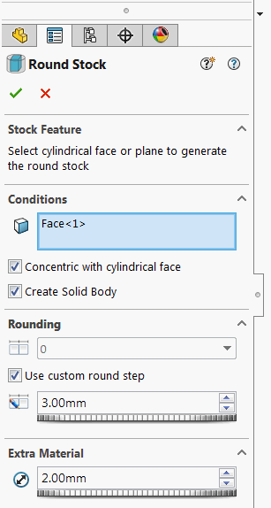

{ width=350 }

该插件允许在选定的实体周围生成圆形库存特征。

用户可以选择圆形面或平面来指定库存的方向。

如果选择了圆形面，则使用其轴作为方向。还可以指定使圆形库存与所选圆形面同心的选项。

特征可以选择生成表示圆形库存的实体。

特征是完全参数化的，一旦参考几何体发生变化，它将自动更新。

特征将值写入配置特定的自定义属性。

可以从[此链接下载插件 v. 0.5.0 (beta 1)](https://github.com/codestackdev/stock-fit-geometry/releases/tag/beta1)。

源代码可在[GitHub](https://github.com/codestackdev/stock-fit-geometry)上找到。

## 演示视频（已过时）

<video style="width: 100%;height: auto" controls>
  <source src="/labs/solidworks/stock-fit-geometry/stock-fit-geometry-preview-demo.mp4" type="video/mp4">
  您的浏览器不支持HTML5视频。
</video>

