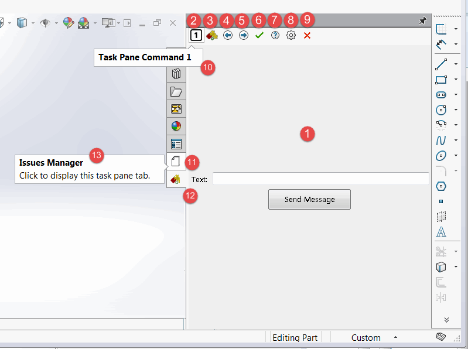

通过调用[ISwAddInEx.CreateTaskPane](https://docs.codestack.net/swex/add-in/html/Overload_CodeStack_SwEx_AddIn_Base_ISwAddInEx_CreateTaskPane.htm)方法，可以在任务窗格中托管任何[System.Windows.Forms.UserControl](https://docs.microsoft.com/en-us/dotnet/api/system.windows.forms.usercontrol?view=netframework-4.8)。

~~~ cs
MyControlHost ctrl;
var taskPaneView = CreateTaskPane<MyControlHost>(out ctrl);
~~~

支持COM可见和非COM可见的控件

~~~ cs
public partial class MyControlHost : UserControl
{
    public IssuesControlHost()
    {
        InitializeComponent();
    }
}
...
[ComVisible(true)]
public partial class MyComVisibleControlHost : UserControl
{
    public IssuesControlHost()
    {
        InitializeComponent();
    }
}
~~~

建议在托管Windows Presentation Foundation (WCF)控件时使用COM可见控件，因为在不可见的控件中可能无法正确处理按键。

## 定义命令

可以定义任务窗格命令以添加为按钮。需要声明包含命令的枚举，并提供命令处理程序。

~~~ cs
public enum TaskPaneCommands_e
{
    Command1
}

...
TaskPaneControl ctrl;
var taskPaneView = CreateTaskPane<TaskPaneControl, TaskPaneCommands_e>(OnTaskPaneCommandClick, out ctrl);
...

private void OnTaskPaneCommandClick(TaskPaneCommands_e cmd)
{
    switch (cmd)
    {
        case TaskPaneCommands_e.Command1:
            //TODO: 处理命令
            break;
    }
}
~~~

可以使用[TitleAttribute](https://docs.codestack.net/swex/common/html/T_CodeStack_SwEx_Common_Attributes_TitleAttribute.htm)和[IconAttribute](https://docs.codestack.net/swex/common/html/T_CodeStack_SwEx_Common_Attributes_IconAttribute.htm)或[TaskPaneIconAttribute](https://docs.codestack.net/swex/add-in/html/T_CodeStack_SwEx_AddIn_Attributes_TaskPaneIconAttribute.htm)为命令指定工具提示和图标。

可以使用[TaskPaneStandardButtonAttribute](https://docs.codestack.net/swex/add-in/html/T_CodeStack_SwEx_AddIn_Attributes_TaskPaneStandardButtonAttribute.htm)属性设置标准图标，其中的值在[swTaskPaneBitmapsOptions_e](https://help.solidworks.com/2012/english/api/swconst/SolidWorks.Interop.swconst~SolidWorks.Interop.swconst.swTaskPaneBitmapsOptions_e.html?id=483920098ca24c378c00773c02483619)枚举中定义。

请参见下图，了解任务窗格元素的图示。

1. 托管在任务窗格中的WinForms用户控件
1. 带有自定义图标的任务窗格按钮
1. 带有默认图标的任务窗格按钮
1. 带有标准swTaskPaneBitmapsOptions_Back图标的任务窗格按钮
1. 带有标准swTaskPaneBitmapsOptions_Next图标的任务窗格按钮
1. 带有标准swTaskPaneBitmapsOptions_Ok图标的任务窗格按钮
1. 带有标准swTaskPaneBitmapsOptions_Help图标的任务窗格按钮
1. 带有标准swTaskPaneBitmapsOptions_Options图标的任务窗格按钮
1. 带有标准swTaskPaneBitmapsOptions_Close图标的任务窗格按钮
1. 任务窗格按钮的工具提示
1. 任务窗格选项卡的自定义图标
1. 任务窗格选项卡的默认图标
1. 任务窗格选项卡的工具提示