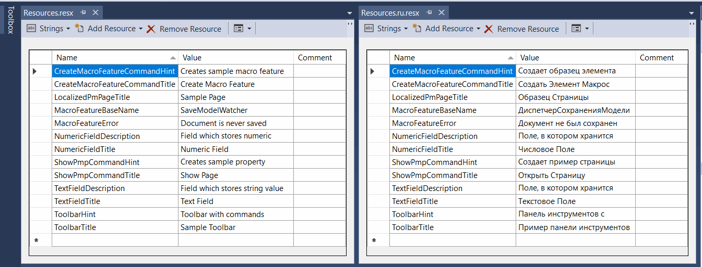
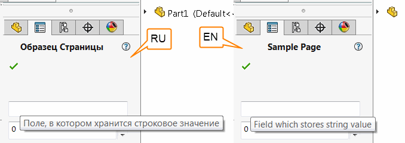

SwEx框架支持[.NET应用程序中的资源](https://docs.microsoft.com/zh-cn/dotnet/framework/resources/index)，以实现插件的本地化，例如支持多种语言。

这种技术允许根据控制面板中的Windows设置在运行时加载本地化字符串。

{ width=450 }

资源应添加到相应的本地化.resx文件中（例如，默认情况下的Resources.resx，俄语的Resources.ru.resx，法语的Resources.fr.resx等）。

为了从资源中引用字符串，可以使用[TitleAttribute](https://docs.codestack.net/swex/common/html/M_CodeStack_SwEx_Common_Attributes_TitleAttribute__ctor_1.htm)和[SummaryAttribute](https://docs.codestack.net/swex/common/html/M_CodeStack_SwEx_Common_Attributes_SummaryAttribute__ctor_1.htm)的构造函数重载，这样可以为SwEx框架中的所有元素（例如[菜单命令](#menu)，[属性页面控件](#property-manager-page)，[宏特征](#macro-feature)等）定义标题、工具提示和提示字符串。

下面是一个示例，演示了这种技术。文本根据以下资源进行本地化：

## 菜单

菜单中的两个命令针对俄语和英语版本的插件进行了本地化。



## 属性管理器页面

属性管理器页面的标题和控件的工具提示针对俄语和英语版本的插件进行了本地化。



## 宏特征

宏特征的基本名称针对俄语和英语版本的插件进行了本地化。

> 注意：基本名称仅在创建特征时分配，特征在区域设置更改后不会被重命名。

类似地，可以使用资源中的字符串返回其他数据，例如宏特征的错误文本。

