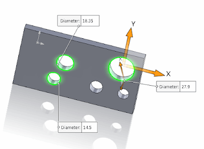
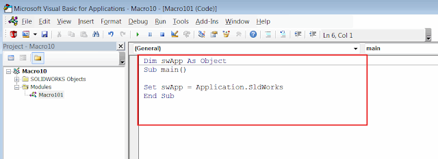

该宏将使用[SOLIDWORKS API方法ISelectionMgr::CreateCallout2](https://help.solidworks.com/2018/english/api/sldworksapi/solidworks.interop.sldworks~solidworks.interop.sldworks.iselectionmgr~createcallout2.html)来显示3D模型中所有选定圆形边缘的直径数值标注。

在检查模型时，同时查看多个直径数值非常有用。

{ width=400 height=290 }

标注是SOLIDWORKS中的一种可视元素，用于以键值对（单行或多行）的形式显示数据。标注元素在一些标准的SOLIDWORKS工具中使用，例如[测量工具](https://help.solidworks.com/2017/english/solidworks/sldworks/t_using_the_measure_tool.htm)。通常，标注会附加到选择对象上，并在取消选择对象后销毁。

运行该宏的步骤：

1. 选择圆形边缘并运行宏
2. 所有圆形边缘的直径数值标注将显示在模型的单位中
3. 清除选择以删除标注

创建新的宏并将以下代码复制到宏的模块中：

{ width=640 height=230 }



创建新的类模块并将其命名为*HoleDiamCalloutHandler*。

{ width=320 height=220 }

将以下代码复制到类模块中：

