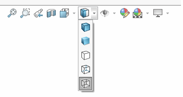
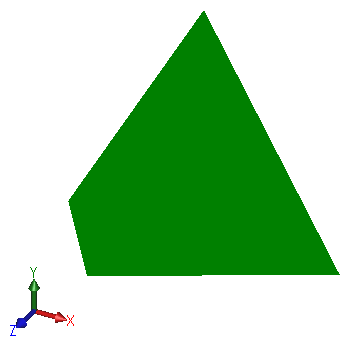

本示例演示了如何使用OpenGL图形渲染四面体几何体，并处理不同的显示模式（着色、带边线的着色、隐藏线消除、隐藏线可见、线框）。

一旦编译完成，每次打开或创建新的三维模型（零件或装配）时，四面体都会被渲染出来。

在SOLIDWORKS模型视图的快捷菜单中更改显示模式，即可看到图形更新。

{ width=350 }

## 显示模式

### 带边线的着色

通过渲染两层图形实现：填充的三角形和在三角形上方的未填充线条。

{ width=200 }

### 着色

通过渲染三角形实现

{ width=200 }

### 隐藏线消除

通过将多边形模式设置为线条来渲染三角形。

{ width=200 }

### 隐藏线可见

通过以线条模式渲染虚线来实现

{ width=200 }

### 线框

通过以线条模式渲染图形来实现

{ width=200 }

源代码可以从[GitHub](https://github.com/codestackdev/solidworks-api-examples/tree/master/swex/add-in/opengl/OglTetrahedron)下载。

## AddIn.vb

这是插件的入口点。使用[SwEx.AddIn](/labs/solidworks/swex/add-in/)框架来管理文档的生命周期，提供了包装类。



## OpenGlDocumentHandler.vb

这是每个模型文档的处理程序类，订阅了SOLIDWORKS提供的OpenGL缓冲区交换通知，并执行四面体三角形坐标的计算和渲染几何体。



## OpenGL.vb

OpenGL函数的导入列表。

