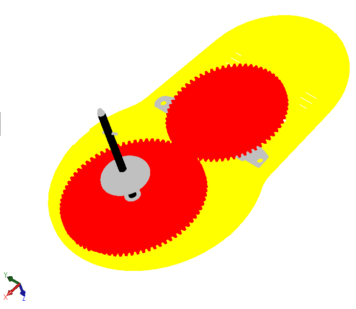

这个C#插件演示了如何使用SOLIDWORKS API将[XAML](https://en.wikipedia.org/wiki/Extensible_Application_Markup_Language)文件中的几何图形导入到活动模型空间中。为了实现最大的性能，图形使用OpenGL的[顶点缓冲对象（VBO）](https://en.wikipedia.org/wiki/Vertex_buffer_object)功能进行渲染。

使用[OpenTK](https://opentk.net/)库来调用OpenGL的API。

插件只能导入从零件文档创建的XAML文件（不支持从装配体导出的XAML文件）。

XAML文件是SOLIDWORKS原生支持的导出格式。使用“文件->另存为”菜单命令以XAML格式导出文件。

{ width=550 }

然而，这种格式不能被原生导入。插件将“导入XAML文件”命令添加到菜单中。打开新文件或现有文件，并使用此命令导入xaml。

{ width=450 }

图形使用OpenGL进行渲染。模型可以旋转、缩放、平移。没有创建特征元素或临时体，图形以高性能渲染。

{ width=350 }

默认情况下，OpenGL的图形不会受到缩放命令的影响。例如，“适应窗口大小”命令不会正确适应几何图形，并会忽略其边界框。要指定可见边界，需要使用[SOLIDWORKS API的IModelDocExtension::SetVisibleBox](https://help.solidworks.com/2017/english/api/sldworksapi/SolidWorks.Interop.sldworks~SolidWorks.Interop.sldworks.IModelDocExtension~SetVisibleBox.html)方法。注意，不需要将现有的SOLIDWORKS几何图形的可见框联合起来，SOLIDWORKS会自动执行此操作。

源代码可以从[GitHub](https://github.com/codestackdev/solidworks-api-examples/tree/master/swex/add-in/opengl/XamlImporter)下载。

## AddIn.cs

这是插件的入口点。使用[SwEx.AddIn](/labs/solidworks/swex/add-in/)框架来管理文档的生命周期，提供包装类。插件处理导入命令，并从指定的XAML文件中提取Microsoft WPF框架的[Model3DGroup](https://docs.microsoft.com/en-us/dotnet/api/system.windows.media.media3d.model3dgroup)对象。



## MeshRendererModel.cs

这是每个模型文档的处理程序类，订阅SOLIDWORKS提供的OpenGL缓冲区交换通知，并根据提供的网格数据进行VBO的绑定和渲染。

