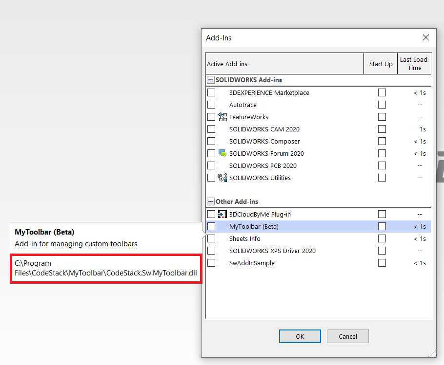

此宏允许使用[SolidWorks::LoadAddIn](https://help.solidworks.com/2018/english/api/sldworksapi/solidworks.interop.sldworks~solidworks.interop.sldworks.isldworks~loadaddin.html)和[SolidWorks::UnloadAddIn](https://help.solidworks.com/2018/english/api/sldworksapi/solidworks.interop.sldworks~solidworks.interop.sldworks.isldworks~unloadaddin.html) SOLIDWORKS API触发指定插件的加载状态。

这对于使用一个按钮点击加载和卸载插件非常有用。建议使用[宏按钮](solidworks-api/getting-started/macros/macro-buttons/)在工具栏上创建一个按钮来加载插件。

宏需要在宏的开头指定插件的全局唯一标识符（GUID）。

~~~ vb
Const ADD_IN_GUID As String = "{1730410d-85ad-4be8-aa2d-ed977b93fe5d}"
~~~

在注册表的*HKLM\SOFTWARE\SolidWorks\AddIns*位置找到所需SOLIDWORKS插件的GUID。该注册表键的每个子键都代表一个插件。选择每个键以查看插件的标题和描述。复制代表插件GUID的键的名称。

{ width=450 }

还可以选择性地在*ADD_IN_PATH*变量中指定插件的路径。在某些情况下，宏无法从其GUID检索插件的路径，可能会失败。您可以在SOLIDWORKS插件对话框中找到插件的路径：

{ width=450 }

~~~ vb
Const ADD_IN_PATH As String = "C:\Program Files\CodeStack\MyToolbar\CodeStack.Sw.MyToolbar.dll"
~~~

如果不使用此选项，请将值设置为空字符串。

~~~ vb
Const ADD_IN_PATH As String = ""
~~~

