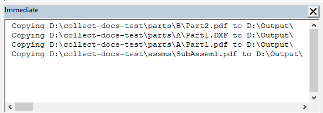

这个VBA宏可以将所有输出文件（如DXF、DWG、PDF等）从所有引用的零件和子装配文档中，包括所有层级，复制到指定的文件夹中。

引用的零件和子装配可以位于任何目录中。它们不必在主装配的同一文件夹或驱动器中。

例如，主装配文件**TopAssm1.sldasm**保存在**C:\Assms**文件夹中，它引用了位于**D:\Parts\A\Part1.sldprt**和**D:\Parts\B\Part2.sldprt**的两个零件文件。Part1和Part2的DXF和PDF文件保存在同一个文件夹中，即**D:\Parts\A\Part1.dxf**、**D:\Parts\A\Part1.pdf**、**D:\Parts\B\Part2.dxf**、**D:\Parts\B\Part2.pdf**。运行此宏后，所有这4个文件将被复制到指定的输出文件夹中。

## 注意事项

* 参考文档的文件名必须与其派生自的文件相同，即**Part1.pdf**派生自**Part1.sldprt**
* 主装配的参考文档也将被包括在内
* 宏将打开文件夹浏览对话框以选择输出文件夹
* 所有被复制的文件路径将输出到VBA编辑器的*Immediate*窗口中
* 被压制的组件将不会被包括在收集中
* 不支持在大型设计审查模式下打开的装配

## 配置

可以通过更改宏开头的常量来配置宏

~~~ vb
Const SEARCH_SUB_FOLDERS As Boolean = False
Const EXTENSIONS As String = "dxf,pdf"
Const ALLOW_OVERWRITE As Boolean = False
~~~

**SEARCH_SUB_FOLDERS**指示宏是否应递归搜索引用的文档。如果将此选项设置为**False**，则只会收集源文件旁边的文件（例如，Part1.dxf必须与Part1.sldprt在同一个文件夹中）。在某些情况下，输出文件可以放置在子文件夹中（例如，Part1.sldprt的DXFs\Part1.dxf），要收集这些文件，请将**SEARCH_SUB_FOLDERS**设置为**True**。注意，如果任何子文件夹中包含另一个同名文件，它也将被收集（例如，A\B\C\Part1.pdf）。

**EXTENSIONS**是一个以逗号分隔的文件扩展名列表，用于收集文件。

**ALLOW_OVERWRITE**选项指示是否需要覆盖目标目录中的文件。建议将此选项设置为**False**，并手动清理目标目录。这将减少覆盖文件和捕捉潜在错误的风险。

