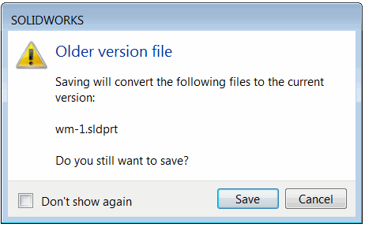

这个VBA宏允许使用SOLIDWORKS API静默保存当前打开和修改过的所有文档。与默认的另存为命令不同，在保存文件时可能会显示各种警告消息，而这个宏将在保存文档时不显示任何弹出消息。

{ width=350 }

宏可以配置为显示错误（如果某些文件未正确保存）或保持静默。

~~~ vb
Const SHOW_ERROR As Boolean = False 'True表示在出现错误时显示消息框，False表示保持静默
~~~

操作的结果将显示在状态栏中。

这个宏可以作为后台集成的一部分使用，其中不应显示模态对话框。

