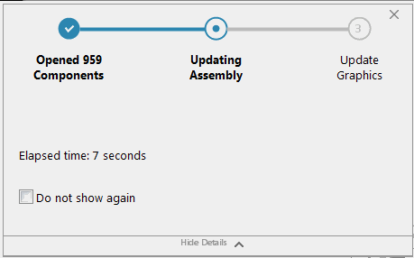

{ width=450 }

这个VBA宏将使用SOLIDWORKS API监听SOLIDWORKS命令（例如打开、重建、抑制、解析等），并通过将执行时间与用户指定的延迟时间进行匹配来识别长时间运行的命令。如果命令运行时间超过此时间段，则播放蜂鸣信号通知用户命令已完成。如果命令执行速度较快，则不会播放声音。

当处理大型模型时，这可能非常有用，因为在执行命令时可以切换屏幕或执行其他活动，并在操作完成后得到通知，而无需不断监视进度。

## 运行说明

* 创建新的宏并添加以下代码



* 通过更改*MIN_DELAY*常量的值来指定命令的最小延迟时间（以秒为单位）
* 创建新的类模块并将其命名为*CommandsListener*。将以下代码粘贴到类模块中：
* 启动宏。要在每个SOLIDWORKS会话中自动启动宏，请参阅[在SOLIDWORKS启动时自动运行宏](/solidworks-api/getting-started/macros/run-macro-on-solidworks-start/)文章。