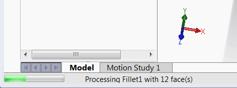

为了改善宏或插件的用户体验，建议在执行长时间的SOLIDWORKS API操作时显示和更新进度条。

SOLIDWORKS API提供了一种内置方法，在主线程被锁定时（即在进程中执行操作）显示进度。进度值和消息可以通过[SOLIDWORKS API接口](https://help.solidworks.com/2017/English/api/sldworksapi/SolidWorks.Interop.sldworks~SolidWorks.Interop.sldworks.IUserProgressBar.html)的[IUserProgressBar](https://help.solidworks.com/2017/English/api/sldworksapi/SolidWorks.Interop.sldworks~SolidWorks.Interop.sldworks.IUserProgressBar.html)接口来处理。

消息和进度显示在应用程序左下角的标准SOLIDWORKS进度条中。

进度也会反映在任务栏中的SOLIDWORKS图标中。

## 注意事项和限制

* 进度值和消息可以被SOLIDWORKS的标准进度消息覆盖（例如重建操作、文件加载等）。

## 运行宏

* 打开带有实体的零件文档
* 宏遍历每个实体的所有面，并对每个面执行数据提取操作
* 操作按照*ITERATIONS_COUNT*常量指定的次数重复
* 显示进度条
* 按ESC键可以选择取消操作

