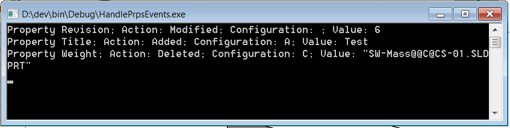

SOLIDWORKS API提供了通知来处理自定义属性的修改（如添加、删除或更改）。这些事件（AddCustomPropertyNotify、DeleteCustomPropertyNotify、ChangeCustomPropertyNotify）适用于零件、装配体和图纸，并支持通用和配置特定的自定义属性。然而，自SOLIDWORKS 2018以来，这些事件不再对用户界面中由用户修改的自定义属性触发，只支持通过SOLIDWORKS API修改的自定义属性。

下面的代码示例提供了解决此问题的方法，并且可以处理无论以何种方式修改自定义属性。

* 创建控制台应用程序并添加以下代码
* 运行控制台
* 修改自定义属性。修改结果将输出到控制台窗口：

## Program.cs

程序的入口点



## CustomPropertiesEventsHandler.cs

