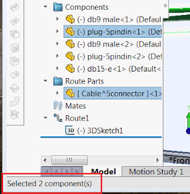

该宏使用SOLIDWORKS API计算所选装配体中所有唯一组件的数量。组件可以在特征管理树或图形区域中选择。

如果仅选择了组件的实体（例如面或边），宏也会计算该组件，使用[SOLIDWORKS API接口ISelectionMgr](https://help.solidworks.com/2018/english/api/sldworksapi/SolidWorks.Interop.sldworks~SolidWorks.Interop.sldworks.ISelectionMgr.html)。

{ width=320 }

