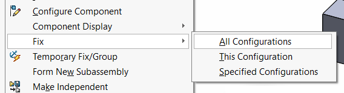

这个VBA示例演示了一个简单的解决方案，用于解决SOLIDWORKS API中缺少在活动配置中修复或浮动组件的问题。[IAssemblyDoc::FixComponent](https://help.solidworks.com/2017/english/api/sldworksapi/solidworks.interop.sldworks~solidworks.interop.sldworks.iassemblydoc~fixcomponent.html)只能修复所有配置中的组件。

创建一个带有2个配置和4个组件实例的示例装配体，其中前2个实例在两个配置中都是浮动的，而后2个实例在两个配置中都是固定的。

运行此宏的结果将使组件变为以下结果：

