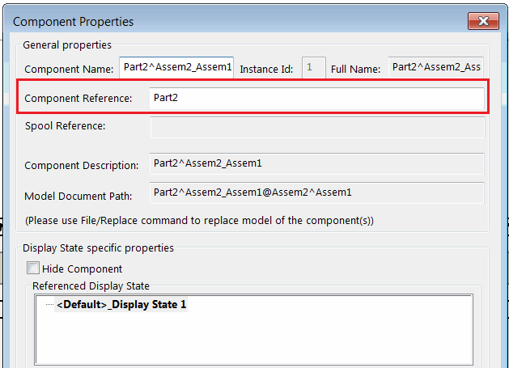

{ width=350 }

此VBA宏允许使用SOLIDWORKS API将活动装配中的组件名称复制到组件引用。

通过将*VIRTUAL_ONLY*选项设置为*True*，宏可以仅处理虚拟组件。

~~~ vb
Const VIRTUAL_ONLY As Boolean = True
~~~

如果组件名称用于存储项目属性（例如零件编号），则此宏可能很有用，因为组件名称无法添加到物料清单，而组件引用可以。

{ width=350 }

