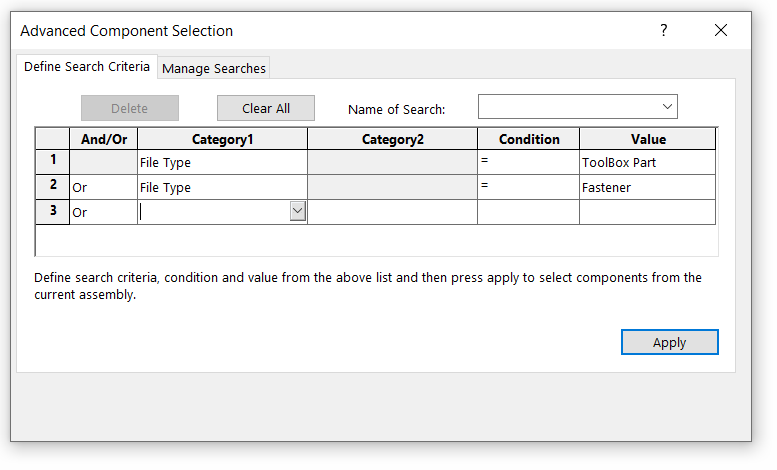
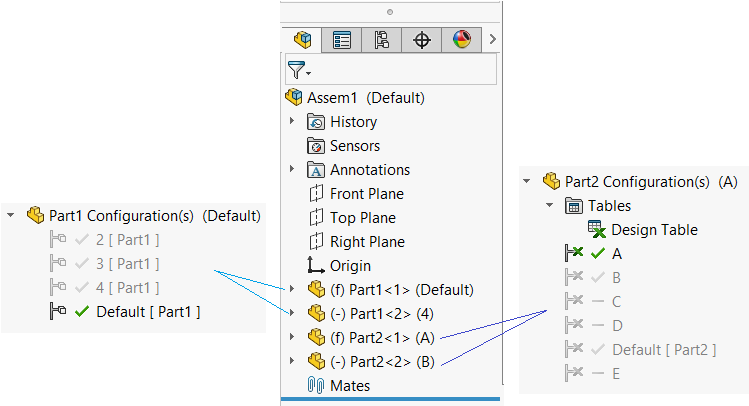
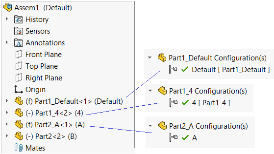

在某些情况下，可能需要从装配中删除（清除）所有未使用的组件配置。这对于紧固件或工具箱组件特别有用，因为文件中可能包含数千个配置，但在装配中只使用了几个。

该宏允许创建所有选定组件的副本，清除其配置，并在装配中替换它们。

> 强烈建议在使用此宏之前备份您的装配

您可以手动选择组件，也可以使用[高级组件选择工具](https://help.solidworks.com/2016/English/SolidWorks/sldworks/c_Advanced_Component_Selection_SWassy.htm)根据条件选择组件（例如紧固件或工具栏）：

对于其他条件，请使用[扩展高级选择宏](/solidworks-api/document/assembly/components/advanced-selection/)。

## 注意事项

* 该宏仅适用于永久组件。对于虚拟组件将生成错误。
* 该宏仅适用于基于零件（*.sldprt）的组件。
* 该宏仅适用于完全加载的组件，不支持抑制或轻量级组件。
* 宏在处理后不保存文档。使用“全部保存”保存所有修改。
* 宏将所有替换部件复制到与源部件相同的位置。
* 可以在特征管理器树中选择组件，也可以从图形视图中选择组件（还可以选择组件的任何实体，例如面或边）。
* 如果存在设计表，将删除设计表。
* 如果目标文件已经存在，宏将不会替换现有文件，并生成“文件已存在”错误。请手动删除所有这些文件。如果宏失败，一些文件可能已加载到内存中，尽管它们在装配中未使用。使用“全部关闭”命令释放这些文件。
* 将重新连接约束。

## 选项

### 替换名称

通过更改“REPLACEMENT_NAME”常量来指定替换文件的名称。使用自由文本和\[title\]和\[conf\]占位符，它们将分别替换为源文件的标题和组件的引用配置。如果将“GROUP_BY_CONFIGURATIONS”选项设置为True，则\[conf\]占位符将被所有配置名称的连接，用_符号分隔。

### 配置分组

“GROUP_BY_CONFIGURATIONS”选项允许指定是否应将引用同一文档但具有不同配置的组件替换为单个组件，还是应为每个组件创建新的单个配置部件。

### 示例

有2个具有多个配置的文件

* Part1.sldprt包含4个配置：默认，2，3和4
* Part2.sldprt包含由设计表驱动的6个配置：默认，A，B，C，D，E
* Part1以默认和4两种配置的形式放置在装配中
* Part2以A和B两种配置的形式放置在装配中

用户选择前3个组件并运行宏。根据指定的设置，将产生以下结果

### 选项1

~~~ vb
Const GROUP_BY_CONFIGURATIONS As Boolean = False
Const REPLACEMENT_NAME As String = "[title]_[conf]"
~~~

结果将生成3个带有单个配置的新文件：Part1_Default.sldprt，Part1_4.sldprt，Part2_A.sldprt（设计表已删除），并且所有选定的组件将被替换。第4个组件不会更改，因为最初没有选择它。

### 选项2

~~~ vb
Const GROUP_BY_CONFIGURATIONS As Boolean = True
Const REPLACEMENT_NAME As String = "[title]_[conf]_replacement"
~~~

结果将生成2个新文件：Part1_Default_4_replacement.sldprt（带有2个配置），Part2_A_replacement.sldprt（设计表已删除），并且所有选定的组件将被替换。第4个组件不会更改，因为最初没有选择它。

