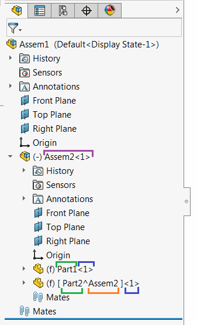

[IComponent2::Name2](https://help.solidworks.com/2012/english/api/sldworksapi/solidworks.interop.sldworks~solidworks.interop.sldworks.icomponent2~name2.html) SOLIDWORKS API 属性提供了读取和更改组件名称的访问器。

该函数在设置或获取时返回不同的名称结构。这意味着如果需要使用原始名称重命名组件（例如添加后缀或前缀），则需要修改从获取访问器返回的值。

当调用**获取**访问器时，将返回组件的完整名称，而**设置**访问器只需要短名称。

组件的完整名称由以下部分组成：

* 组件名称
* 组件索引（在完整名称中的**-**符号后指定）
* 虚拟组件的上下文名称（在完整名称中的**^**符号后指定）
* 父装配的完整名称（在完整名称中的**/**符号前指定）

上图中结构中的组件名称将返回如下（图片中的颜色与名称中的零件匹配）：

Assem2-1 *根组件*

Assem2-1/Part1-1 *子装配中的组件*

Assem2-1/Part2^Assem2-1 *子装配中的虚拟组件*

下面的示例使用SOLIDWORKS API通过向其名称添加后缀来重命名任何选定的组件（根级别、子装配中的组件和虚拟组件）。

