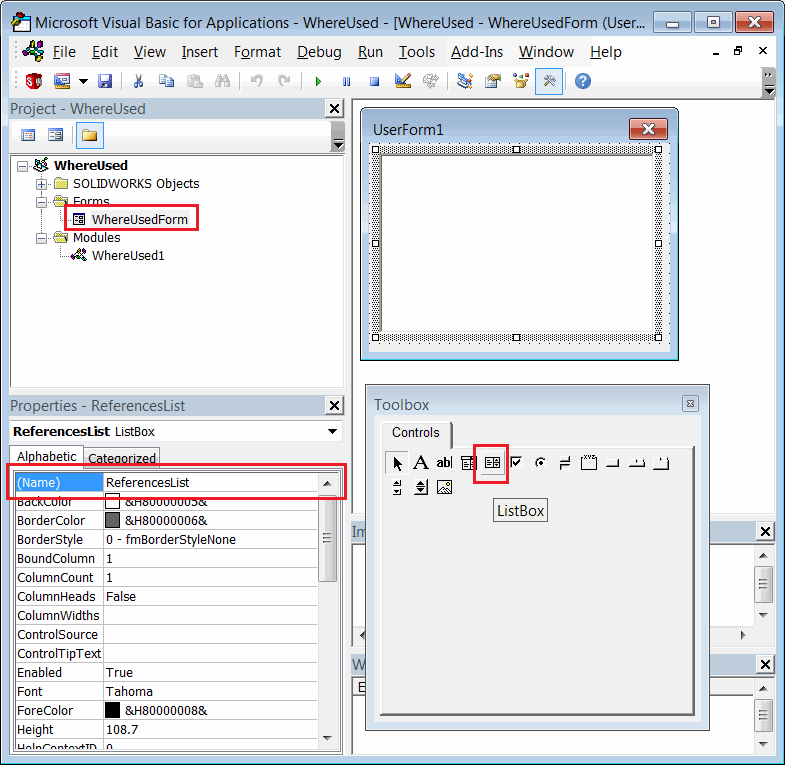

此VBA宏使用SOLIDWORKS API查找活动装配体中所选组件实例的所有父级组件（使用情况），并显示供审核的列表。

{ width=350 }

可以在表单中选择所有引用，并在特征管理器树中突出显示相应的组件。

## 配置

可以通过更改宏开头的常量参数来配置宏，如下所示：

~~~ vb
Const CONSIDER_CONFIG As Boolean = False 'True表示仅查找具有相同引用配置的组件，False表示仅按模型路径查找
Const INCLUDE_SUPPRESSED As Boolean = False 'True表示在搜索中包括被抑制的组件，False表示不包括
~~~

## 创建宏

* 创建新的宏
* 添加新的[用户窗体](/visual-basic/user-forms/)
* 将窗体命名为*WhereUsedForm*
* 将ListBox控件拖放到窗体上
* 将ListBox控件命名为*ReferencesList*

{ width=550 }

将代码放入相应的模块中

### 宏



### WhereUsedForm

