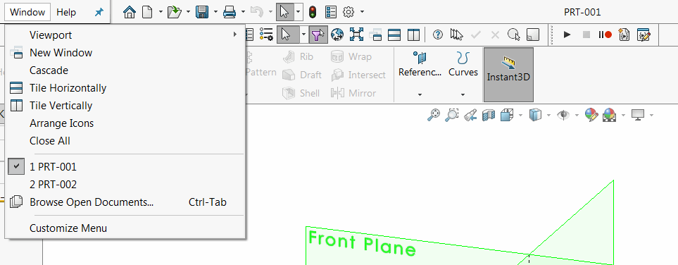
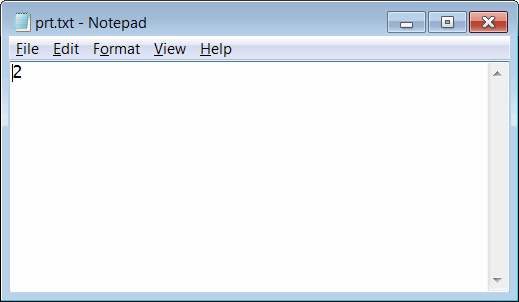

{ width=450 }

这个VBA宏使用SOLIDWORKS API自动递增零件编号，并将其设置为新创建文件的标题。

零件编号递增并存储在外部文本文件中，如果需要，可以在不同用户之间共享。

{ width=350 }

宏提供了几种格式化标题的选项，可以通过修改宏中常量的值来进行更改。

~~~ vb
Const NMB_SRC_FILE_PATH As String = "D:\prt.txt" '存储当前零件索引的路径
Const NMB_FORMAT As String = "000" '数字的填充，例如001、002，而不是1、2
Const BASE_NAME As String = "PRT-" '文件命名的基本前缀
~~~

请参考[在文档加载时运行宏](solidworks-api/application/documents/handle-document-load/)文章中的视频教程，了解如何自动运行此宏以为每个新创建的模型运行。

