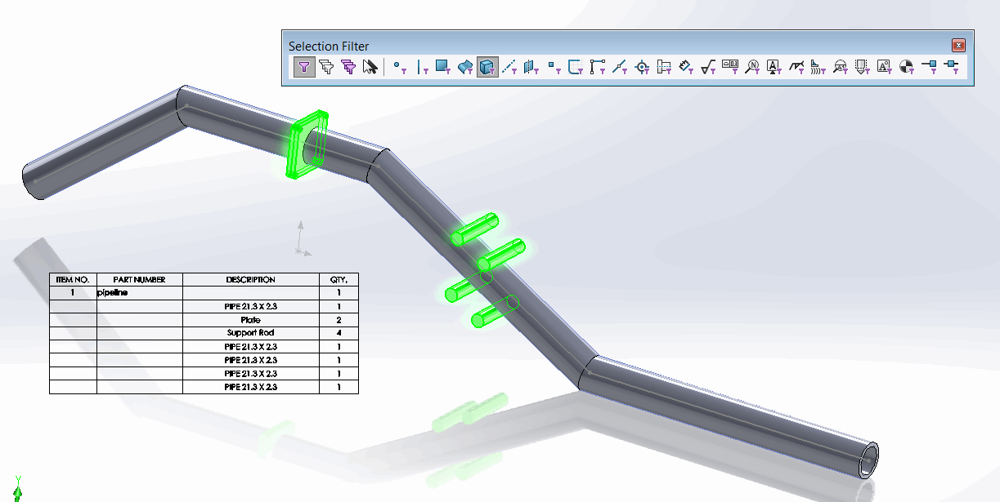

{ width=300 }

该宏允许使用SOLIDWORKS API从焊接件或钣金切割清单中排除选定的实体。

可以在图形视图或特征树中选择实体，这样可以更轻松地完成操作，无需查找相应的切割清单特征来排除实体。

可以使用[选择过滤器](https://help.solidworks.com/2013/english/solidworks/sldworks/r_selection_filter_selection.htm)来简化从图形区域中选择所需实体的过程。

还可以选择要排除的实体的面、边或顶点。

{ width=500 }

观看[视频演示](https://youtu.be/9uZCecGg25I?t=509)

