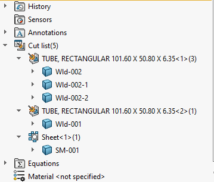

这个VBA宏允许根据预定义的命名模板重命名属于切割清单文件夹（例如钣金或焊接）的所有体。可以使用自由文本结合自定义属性占位符，以在名称中使用自定义属性。

自定义属性必须用```<>```符号括起来。

例如，要使用**SM_**前缀重命名所有钣金体，后跟厚度的值，应将**NAME_TEMPLATE**变量定义为：

~~~ vb
Const NAME_TEMPLATE As String = "SM_<Thickness>"
~~~

## 注意事项

* 运行后，宏可能需要模型重建以刷新特征的名称
* 如果一个切割清单文件夹中有多个体，将使用索引来区分名称，例如-1，-2，-3
* 在重命名之前，宏将执行切割清单的更新

