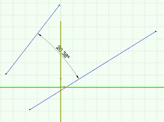

本示例使用SOLIDWORKS API在两个选定的草图线段（例如草图线）之间添加尺寸。尺寸将放置在两个选定点的中间。

{ width=320 height=237 }

在使用SOLIDWORKS API以编程方式添加尺寸时，重要的是禁用输入尺寸值选项，否则宏将被中断并需要用户输入。

下面的示例临时移除了此选项，并在插入尺寸后恢复原始值，以确保不影响用户设置。

{ width=640 height=198 }

