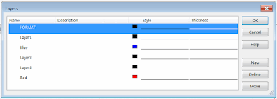

该宏将使用SOLIDWORKS API将绘图工作表中的所有选定对象移动到指定的图层。

{ width=400 }

SOLIDWORKS API没有通用的::Layer属性来更改任何实体的图层，而是将此属性添加到支持它的每个接口中（例如[ISketchSegment::Layer](https://help.solidworks.com/2018/english/api/sldworksapi/solidworks.interop.sldworks~solidworks.interop.sldworks.isketchsegment~layer.html)属性）。该宏检查实体的类型，并调用相应的SOLIDWORKS API属性来更改图层。

