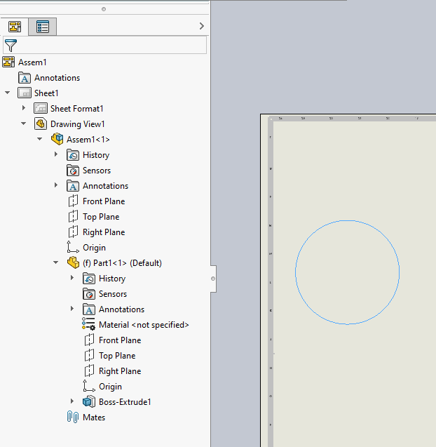

这个VBA宏演示了如何从底层的3D文档中找到特定命名的边缘，并在绘图视图中选择它。

这种技术可以在开发绘图自动化宏和应用程序时使用。

> 注意，在您的宏中，您可能不会使用命名实体，而是可以应用一些不同的逻辑（例如，通过坐标、颜色、属性等进行查找）。然而，将指针转换为绘图视图空间的过程是相同的。

这个宏将与包含命名边缘的顶层组件的装配体的绘图视图一起工作，如下所示：

> 如果需要，可以参考[按名称获取组件](/solidworks-api/document/assembly/components/get-by-name/)示例中的代码来获取任何级别上的组件。

边缘的名称需要从相应的零件文档中分配。

