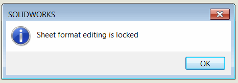

{ width=250 }

这个VBA宏允许使用SOLIDWORKS API禁用（或密码保护）SOLIDWORKS绘图中工作表格式的编辑。

当需要禁止用户修改标准工作表格式时，这个宏非常有用。

宏提供了两个选项，可以通过修改下面的常量进行配置：

~~~ vb
Public Const LOCK_WITH_PASSWORD As Boolean = False
Public Const PASSWORD As String = ""
~~~

## 锁定编辑

将*LOCK_WITH_PASSWORD*的值设置为*False*。

每次调用*编辑工作表格式*命令并取消命令时，都会显示以下消息：

## 密码保护编辑

将*LOCK_WITH_PASSWORD*的值设置为*True*。将*PASSWORD*的值设置为目标密码。

建议对VBA宏进行密码保护，以防止密码从宏本身中泄露。

每次调用*编辑工作表格式*命令时，都会显示以下提示：

如果密码匹配，则可以编辑工作表格式；否则，命令将被取消并显示错误消息。

## 创建宏

* 创建新的宏，并粘贴[宏模块](#macro-module)中的代码。
* 添加新的[类模块](/visual-basic/classes/)，并将其命名为*SheetFormatEditorHandler*。将下面的[代码](#sheetformateditorhandler-class)粘贴到类模块中。
* 添加新的[用户窗体](/visual-basic/user-forms/)，并将其命名为*PasswordBox*。将下面的[代码](#passwordbox-user-form)粘贴到用户窗体代码中。
* 根据下图所示添加控件，并按照图像上标记的名称指定每个控件的名称。

* 将文本框控件的*PasswordChar*属性值设置为\*，以在用户界面中输入时隐藏密码。

文件树应该类似于下图。

按照[SOLIDWORKS启动时运行宏](/solidworks-api/getting-started/macros/run-macro-on-solidworks-start/)的说明设置宏在SOLIDWORKS启动时自动运行。

## 阻止其他命令

可以修改此宏以阻止其他命令。还可以更改以同时处理多个命令。为此，需要修改以下行：

~~~ vb
If Command = swCommands_Edit_Template Then
~~~

改为

~~~ vb
If Command = CmdId1 Or Command = CmdId2 ... Or Command = CmdId3 Then
~~~

例如，以下行将阻止编辑草图、打开SOLIDWORKS选项对话框和打印文档。请参考[Capture Commands](/solidworks-api/application/frame/capture-commands/)宏，了解如何提取SOLIDWORKS中特定命令的ID。

~~~ vb
If Command = 859 Or Command = 342 Or Command = 589 Then
~~~

### 宏模块



### SheetFormatEditorHandler类



### PasswordBox用户窗体

