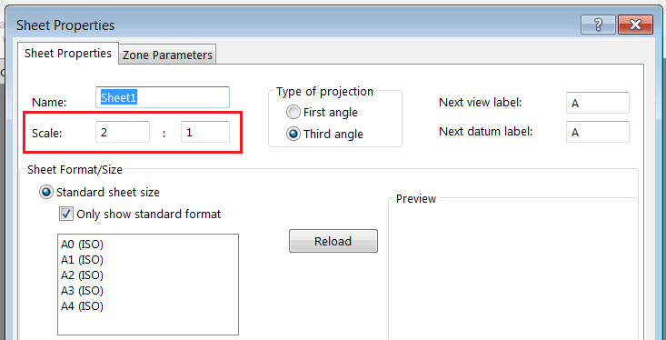

这个代码示例演示了如何使用SOLIDWORKS API在绘图视图中绘制模型边界框的对角线。

{ width=250 }

边界框坐标系是从绘图视图的底层模型中提取的。这些坐标是相对于零件或装配体绘图视图的全局坐标系的。

为了将坐标正确转换为绘图页空间，需要考虑以下几点：

* 绘图视图的转换。可以使用[SOLIDWORKS API的IView::ModelToViewTransform](https://help.solidworks.com/2018/english/api/sldworksapi/solidworks.interop.sldworks~solidworks.interop.sldworks.iview~modeltoviewtransform.html)方法来提取。
* 绘图页的转换。
* 绘图页的比例尺。

{ width=350 }

上述转换的组合将返回从模型空间到当前绘图页空间的完整转换坐标。

> 在将草图线段插入绘图页时，需要调用[IDrawingDoc::ActivateView](https://help.solidworks.com/2018/english/api/sldworksapi/solidworks.interop.sldworks~solidworks.interop.sldworks.idrawingdoc~activateview.html)方法并将参数设为空字符串，以激活绘图页空间。否则，实体将直接插入视图文档的模型空间中。

## 运行宏

* 打开绘图
* 插入零件或装配体的视图
* 修改视图和绘图页比例尺。您还可以旋转视图
* 运行宏。结果是在绘图页空间中绘制了表示底层模型边界框的对角线
* 移动视图。请注意，创建的线段不会随视图移动，这意味着它是在绘图页空间中创建的

{ width=300 }

