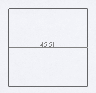

类似于[装配上下文](/solidworks-api/document/assembly/context/)，绘图上下文也存在。指向实体的指针可能存在于底层模型上下文和绘图视图上下文中。

当需要在绘图视图中选择底层模型上下文中的实体（例如用于尺寸目的）时，可以调用[SOLIDWORKS API的IView::SelectEntity](https://help.solidworks.com/2018/english/api/sldworksapi/solidworks.interop.sldworks~solidworks.interop.sldworks.iview~selectentity.html)方法。SOLIDWORKS将自动在绘图视图中找到相应的实体指针并选择它。

此示例演示了如何使用SOLIDWORKS API在底层零件模型中的两个命名边（Edge1和Edge2）之间添加线性尺寸。可以通过以下属性对话框为实体命名：

{ width=350 }

结果是在边之间添加了尺寸。

{ width=250 }

尺寸的位置是通过在尺寸边的中点之间绘制的线的中点找到的。与[工作表上下文中的绘图](/solidworks-api/document/drawing/sheet-context-sketch/)不同，当定位尺寸时，不需要将绘图工作表比例乘以视图变换矩阵。

