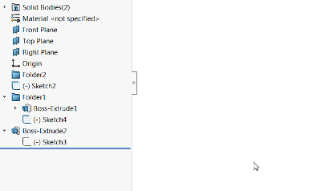

在SOLIDWORKS特征树中删除顶层文件夹时，所有子特征都不会被删除，因此需要逐个选择它们以删除文件夹内容。

由于特征之间的关系，这并不总是能够一次完成：

{ width=400 }

下面的宏使用SOLIDWORKS API，允许一键删除所选文件夹中的所有特征。支持嵌套文件夹。

{ width=400 }

宏可以选择是否显示确认对话框，其中列出将要被删除的特征列表。

观看[视频演示](https://youtu.be/9uZCecGg25I?t=396)

