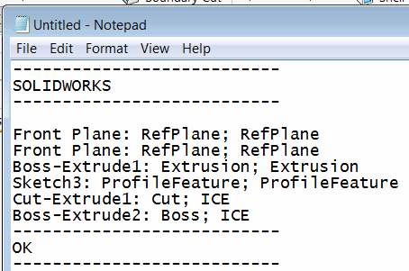

这个VBA宏使用SOLIDWORKS API读取特征管理器树中所选特征的类型名称，并以以下格式在消息框中显示结果：

~~~
<特征名称>: <类型名称1>, <类型名称2>
~~~

{ width=350 }

其中，*类型名称1* 是通过[SOLIDWORKS API方法IFeature::GetTypeName](https://help.solidworks.com/2016/english/api/sldworksapi/solidworks.interop.sldworks~solidworks.interop.sldworks.ifeature~gettypename.html)检索到的特征类型名称的旧版本，而*类型名称2*是通过[SOLIDWORKS API方法IFeature::GetTypeName2](https://help.solidworks.com/2016/english/api/sldworksapi/solidworks.interop.sldworks~solidworks.interop.sldworks.ifeature~gettypename2.html)检索到的新版本。

对于使用Instant3D功能创建的基准挤出和切割挤出特征，*类型名称2*将等于*ICE*。使用*类型名称1*的值来获取特定的特征类型名称。

如果需要将结果复制为文本格式，只需点击消息框，按下*Ctrl+C*复制该值，然后通过*Ctrl+V*将其粘贴到任何文本编辑器（如记事本）中：

{ width=250 }

