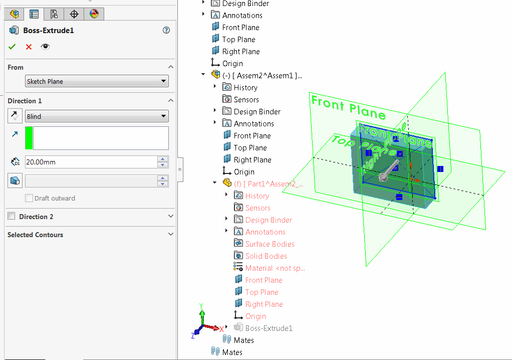

{ width=450 }

本示例演示了如何使用SOLIDWORKS API在装配上下文中修改特征定义。

宏中执行的步骤相当于在SOLIDWORKS用户界面中执行以下步骤：

* 选择包含挤压特征的零件组件
* 在组件的上下文菜单中选择“编辑零件”菜单
* 选择挤压特征并从上下文菜单中选择“编辑”命令
* 修改挤压特征的正向方向的值
* 点击绿色勾号
* 退出编辑零件模式

在装配中编辑特征时，重要的是要遵循正确的[装配上下文](/solidworks-api/document/assembly/context/)。

* 下面的示例是使用VSTA3宏实现的
* 在装配中选择零件组件
* 将挤压特征的名称指定为*EXTRUDE_FEAT_NAME*变量的值
~~~ cs
const string EXTRUDE_FEAT_NAME = "Boss-Extrude1";
~~~
* 运行宏。结果是将挤压的值更改为*EXTRUDE_DEPTH*变量的值（以米为单位）
~~~ cs
const double EXTRUDE_DEPTH = 0.02;
~~~

