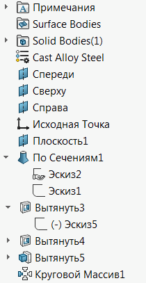
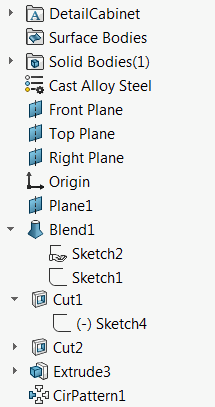

这个VBA宏允许使用SOLIDWORKS API基于指定的规则和特征类型名称重命名零件文档中的特征管理树。

这个宏可以用作一个翻译宏，将特征树从一种语言重命名为另一种语言。

例如，这个特征树是用俄语编写的：

{ width=150 }

它可以被重命名为英语版本的等效特征树：

{ width=150 }

## 配置

宏使用2个文件中指定的数据，这些文件必须与宏存储在同一个文件夹中：

~~~ vb
Const NO_INCREMENT_FILE As String = "noincrement.csv"
Const CUSTOM_MAP_FILE As String = "custommap.csv"
~~~

这些文件可以在Excel或任何文本编辑器（如记事本）中进行编辑。

### 不递增的CSV文件

该文件包含不应递增命名的特征类型名称（即它们在树中只出现一次），例如*原点*特征或*文档文件夹*。

这是一个单列的CSV文件。[下载](noincrement.csv)

### 自定义映射CSV文件

该文件包含特征类型的特殊名称。默认情况下，特征将以其类型命名，但可以在此文件中覆盖此行为。例如，*草图*特征的类型名称是*OriginProfileFeature*，所以默认情况下，所有草图将被重命名为*OriginProfileFeature1*、*OriginProfileFeature2*、*OriginProfileFeature3*等，除非在*custommap.csv*文件中添加以下行：

~~~
OriginProfileFeature,Sketch
~~~

在这种情况下，草图将被重命名为*Sketch1*、*Sketch2*、*Sketch3*等。

这是一个2列的CSV文件。

[下载](custommap.csv)

## 特征类型

特征类型是特征种类的语言无关标识符。使用[获取特征类型名称](/solidworks-api/document/features-manager/get-feature-type-name/) VBA宏提取类型名称。除非它等于*ICE*（在这种情况下使用*Type Name 1*），否则使用*Type Name 2*。

### 特殊特征类型

有几种特殊类型的特征可用于重命名

* _FrontPlane
* _RightPlane
* _TopPlane

