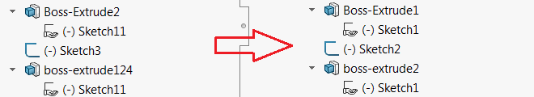

该宏使用SOLIDWORKS API按顺序重命名活动模型中的所有特征，保留基本名称。

只重命名索引，保留基本名称。例如，*Sketch21*将在第一次出现时重命名为*Sketch1*。

## 注意事项

* 只会重命名以数字结尾的特征（例如，*Front Plane*不会重命名为*Front Plane1*，*My1Feature*也不会重命名）
* 不区分大小写（不区分大小写搜索）
* 只会重命名建模特征（在原点特征之后创建的特征）
* 在装配文档中，只会重命名装配特征（组件会被忽略）
* 如果在装配中选择了组件，则会重命名这些组件的特征

观看[视频演示](https://youtu.be/jsjN8zNRTuc?t=139)

