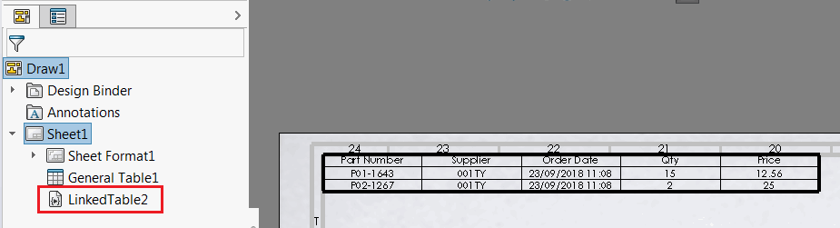

{ width=350 }

该宏功能允许在零件、装配和绘图中创建通用表格，并使用SOLIDWORKS API将其链接到外部的Excel或文本/CSV文件。运行该宏功能后，表格将根据外部文件中的数据插入到特征树中，并自动更新。

* 运行该宏功能
* 在第一个提示对话框中指定Excel文件（*.xls或*.xlsx）或逗号分隔的文本文件（*.csv或*.txt）的完整路径
* 可选择指定要从中读取数据的电子表格的名称。如果指定为空字符串，则使用第一个电子表格

该宏功能将在特征树中插入表格和宏功能，并使用外部文件中的数据。修改文件或通用表格并重建模型，表格将会更新。

## 注意事项和限制

* 仅支持简单的CSV文件（即简单的逗号分隔值，不支持换行符或值中的逗号）
* 使用CSV文件时不需要安装Excel
* 使用CSV文件具有显著的性能优势，因为无需启动Excel和加载文档即可获取数据。在适用的情况下，请使用此选项
* Excel将以不可见方式显示，并且会缓存会话以获得更好的性能优势
* 如果将CSV或Excel文件保存相对于模型 - 将保持相对路径。这意味着SOLIDWORKS文件可以与Excel/CSV文件一起移动，链接不会断开
* 如果在插入新特征时选择了通用表格 - 将使用该表格而不是创建新表格
* 目前无法更改外部Excel文件的路径。请删除宏功能，然后通过选择通用表格重新插入它（参见前面的说明）
* 宏功能嵌入到模型中，这意味着即使此宏功能不可用，表格也将在任何其他工作站上更新。

