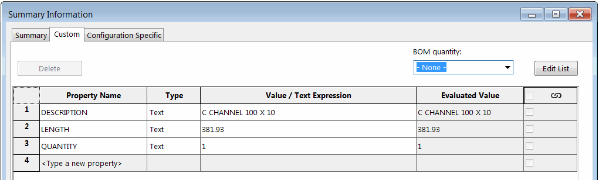

{ width=450 }

这个VBA宏使用SOLIDWORKS API将宏特性插入到零件文件中，允许将指定的切割列表自定义属性动态链接到文件的通用自定义属性。

{ width=250 }

当父级焊接特征（例如结构成员特征）发生更改时，宏特性会自动重建。再生方法处理后续更新通知，允许读取切割列表自定义属性的最新值。

> 直接从swmRebuild函数中读取自定义属性将不会返回最新值，因为在再生时，尚未评估所有属性。

宏特性插入到特征树中，可以被抑制或删除。

与直接使用表达式链接属性（例如`"LENGTH@@@Al I BEAM STD 4x3.28<1>@Part1.SLDPRT"`）相比，这种方法有几个优点：

* 链接不依赖于名称，即使切割列表重命名（例如更改结构成员剖面），属性仍然保持链接
* 宏将适用于旧版钣金零件结构。使用表达式链接在旧版SOLIDWORKS中构建的钣金零件上不起作用

{ width=250 }

## 操作说明

* 创建新的宏并复制下面的代码



* 向宏添加新的类模块，并将其命名为*PostRegenerateListener*。将下面的代码放入类模块中



* 在*PostRegenerateListener*的*Class_Initialize*函数中配置需要链接的属性

~~~ vb
Private Sub Class_Initialize()
    LinkedProperties = Array("DESCRIPTION", "LENGTH", "QUANTITY", "Another Property", "...")
End Sub
~~~

* 选择焊接特征（例如结构成员）并运行宏。宏特性将被插入并嵌入到模型中。您可以关闭和重新打开模型和SOLIDWORKS会话 - 特征将自动重建。模型可以与其他用户共享，行为将被保留。