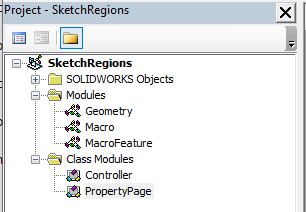

 { width=500 }

这个VBA宏演示了如何使用VBA创建参数化的SOLIDWORKS宏特征，以便从多个草图中创建单个挤出体。

观看下面的视频，演示了宏的使用方法以及如何构建和工作原理。



创建以下宏结构，并将代码片段复制到相应的模块和类中。

属性管理器页面在**SolidWorks {{Version}} exposed type library for add-in use**类型库中定义。因此，需要将其添加到VBA宏的引用中。

为了添加自定义图标，请下载[图标](Icons.zip)文件并解压缩到宏特征文件旁边的**Icons**子文件夹中。

## 宏模块

宏的入口点。使用此处插入新的宏特征。



## 几何模块

该模块包含用于构建从输入草图中的挤出体的临时几何体的辅助函数。



## 宏特征模块

实现宏特征的行为：重建和编辑。



## PropertyPage类模块

实现宏特征的属性管理器页面接口。



## Controller类模块

将属性管理器页面的输入连接到相应的功能（即编辑或插入）。



[下载示例模型](MacroFeatureMultiExtrude.SLDPRT)