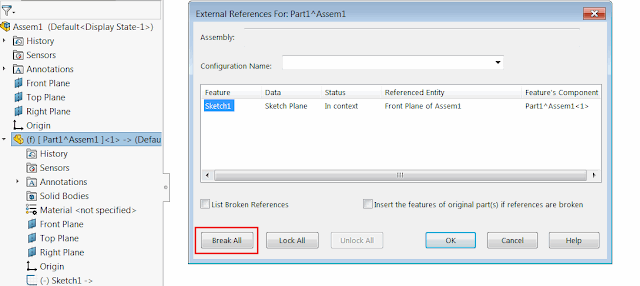

该示例将使用SOLIDWORKS API在活动模型或活动装配中打破、锁定或解锁所有外部引用。

{ width=640 }

## 配置

可以通过修改常量的值来配置宏

~~~ vb
Const MODIFY_ACTION As Integer = ModifyAction_e.UnlockAll '在模型中调用引用的操作。支持的值：BreakAll、LockAll、UnlockAll
Const REFS_SCOPE As Integer = Scope_e.AllComponents '运行上述操作的范围。支持的值：ThisFile、TopLevelComponents、AllComponents、SelectedComponents
~~~

## CAD+

该宏与[Toolbar+](https://cadplus.xarial.com/toolbar/)和[Batch+](https://cadplus.xarial.com/batch/)工具兼容，因此可以将按钮添加到工具栏并分配快捷键以便更方便地访问或批量运行。

要启用[宏参数](https://cadplus.xarial.com/toolbar/configuration/arguments/)，请将**ARGS**常量设置为true

~~~ vb
#Const ARGS = True
~~~

在这种情况下，不需要复制宏以设置单独的[操作和范围选项](#configuration)。

而是指定2个参数：

1. 使用**-b**、**-l**、**-u**来分别设置操作为**打破所有**、**锁定所有**、**解锁所有**
1. 使用**-f**、**-t**、**-a**来分别设置范围为**此文件**、**顶层组件**、**所有组件**

例如，下面的参数将锁定文件本身的所有外部引用

~~~
> -l -f
~~~

而以下命令将打破装配中所有组件（包括子组件）的所有外部引用

~~~
> -b -a
~~~

