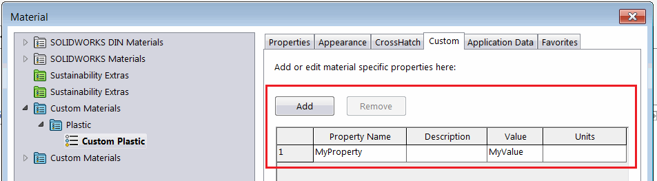

{ width=450 }

该宏演示了如何使用SOLIDWORKS API和XML解析器将指定的自定义属性从材料数据库复制到模型的自定义属性。

使用*MSXML2.DOMDocument*对象来读取材料数据库的XML并选择所需的材料节点。

* 通过*PRP_NAME*变量指定要复制的自定义属性名称

~~~ vb
Const PRP_NAME As String = "MyProperty"
~~~

* 运行宏。宏将查找活动零件的材料并从材料数据库文件中读取属性值
* 宏将创建/更新文件的通用自定义属性，使其与材料的自定义属性值相对应

