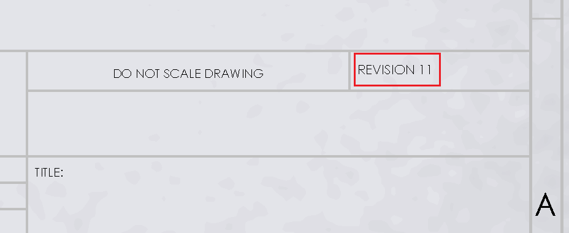

{ width=300 }

该宏使用SOLIDWORKS API来增加注释的数值。如果需要增加注释的修订版本而无需手动选择和更改注释，则这将非常有用。该宏还可以在批处理软件中使用。

* 数值通过指定的[正则表达式](https://en.wikipedia.org/wiki/Regular_expression)进行匹配。可以修改正则表达式以匹配特定的数值。注释可以包含自由文本（在这种情况下，只有数值部分将根据指定的正则表达式进行更新）
* 需要在注释中添加文本标签以增加其数值。请按照[向选定的注释添加标签](/solidworks-api/document/notes/tag-selected-note)示例中的说明添加标签到注释中。
* 默认情况下，数值将增加1，但可以通过修改*IncrementNoteValue*函数的*increment*参数的值来更改。

