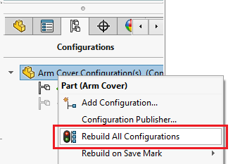

这个VBA宏允许执行通常需要升级SOLIDWORKS模型到新版本所需的操作。它可以：

* 强制重建模型（ctrl+Q）

* 将模型设置为等轴方向

* 隐藏所有视图类型

通过设置相应常量的值来配置宏的操作

~~~ vb
Const DEFAULT_VIEWZOOMTOFIT As Boolean = True
Const DEFAULT_REBUILD As Boolean = True
Const DEFAULT_HIDE_ALL_TYPES As Boolean = True
~~~

此宏还支持[宏参数](https://cadplus.xarial.com/macro-arguments/)：**-zoomtofit**，**-rebuild**，**-hidealltypes**

