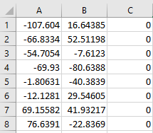

{ width=500 }

这个VBA宏允许将所选草图中的所有点坐标导出到CSV文件中。

CSV文件可以在Excel中打开。

宏有一个选项，可以将坐标导出到草图空间（2D草图的XY坐标）或模型空间（XYZ坐标）。宏还有一个选项，可以将点坐标转换为系统单位（米）或当前分配给模型的用户单位。

通过更改下面的常量来配置宏。

~~~ vb jagged-bottom
Const CONVERT_TO_USER_UNIT As Boolean = True 'True表示使用当前模型单位，False表示使用系统单位（米）
Const CONVERT_TO_MODEL_SPACE As Boolean = True '对于2D草图，True表示将坐标导出到草图空间，False表示将坐标转换到模型空间
Const OUT_PATH As String = "D:\points.csv" '输出文件的完整路径
~~~

