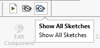

该宏将使用SOLIDWORKS API隐藏（空白）或显示（取消空白）活动文档中的所有草图（2D和3D）。

如果活动文档是一个装配体，则还将包括所有组件的草图。

{ width=320 }

## 配置

更改*HIDE_ALL_SKETCHES*选项以指定是否需要隐藏或显示草图。

## CAD+

该宏与[Toolbar+](https://cadplus.xarial.com/toolbar/)和[Batch+](https://cadplus.xarial.com/batch/)工具兼容，因此可以将按钮添加到工具栏并分配快捷键以便更轻松地访问或批量运行。

为了启用[宏参数](https://cadplus.xarial.com/toolbar/configuration/arguments/)，将**ARGS**常量设置为true

~~~ vb
#Const ARGS = True
~~~

在这种情况下，不需要复制宏来设置单独的[隐藏和显示选项](#configuration)。而是使用**-hide**和**-show**参数相应地隐藏和显示草图。

您可以下载每个按钮的图标：[隐藏草图](hide-sketches.svg)，[显示草图](show-sketches.svg)或使用您自己的图标。

观看[视频演示](https://youtu.be/jsjN8zNRTuc?t=23)

