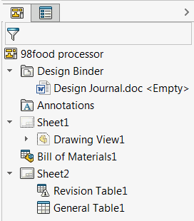

{ width=250 }

此示例使用SOLIDWORKS API从活动绘图文档中按指定类型查找所有表格。

需要使用Array函数指定类型数组，其中每个值表示表格的类型（BOM、常规、切割清单、修订、标题块等），如[swTableAnnotationType_e](https://help.solidworks.com/2017/english/api/swconst/solidworks.interop.swconst~solidworks.interop.swconst.swtableannotationtype_e.html)枚举中定义的。

作为结果，返回指向[ITableAnnotation](https://help.solidworks.com/2017/english/api/sldworksapi/SolidWorks.Interop.sldworks~SolidWorks.Interop.sldworks.ITableAnnotation.html) SOLIDWORKS API接口的指针数组，并将每个表格的标题输出到VBA编辑器的即时窗口。

