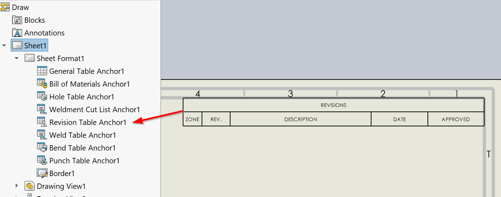

{ width=600 }

此VBA宏将修订表插入活动SOLIDWORKS图纸的所有或活动工作表中。

修订表附加到修订锚点。

修改宏中的常量以配置修订表选项。

~~~ vb
Const ANCHOR_TYPE As Integer = swBOMConfigurationAnchorType_e.swBOMConfigurationAnchor_TopLeft '锚点类型：swBOMConfigurationAnchor_BottomLeft，swBOMConfigurationAnchor_BottomRight，swBOMConfigurationAnchor_TopLeft，swBOMConfigurationAnchor_TopRight
Const TABLE_TEMPLATE As String = "" '修订模板的完整路径*.sldrevtbt，或空字符串以使用默认模板
Const SHAPE As Integer = swRevisionTableSymbolShape_e.swRevisionTable_CircleSymbol '符号形状：swRevisionTable_CircleSymbol，swRevisionTable_HexagonSymbol，swRevisionTable_SquareSymbol，swRevisionTable_TriangleSymbol
Const AUTO_UPDATE_ZONE_CELLS As Boolean = True 'True表示自动更新区域单元格

Const ALL_SHEETS As Boolean = True 'True表示处理所有工作表，False表示仅处理活动工作表
~~~

