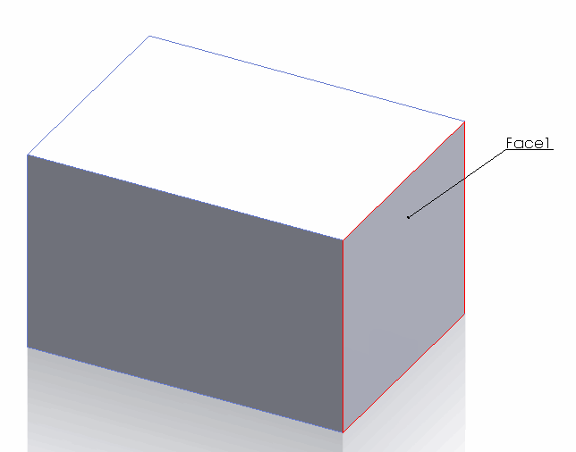

{ width=300 }

模型中的一些SOLIDWORKS对象可以被赋予用户名称。这些名称是模型中对象的唯一标识，并且在重建操作或会话中保持不变。可以从GUI中查看和编辑名称。

以下对象类型有名称：

* 组件
* 配置
* 特征
* 图层
* 实体
* 平面
* 尺寸
* 实体（面、边、顶点）
* 草图段（直线、弧线、样条曲线、椭圆）
* 绘图视图

### 实体名称

默认情况下，实体（面、边、顶点）没有名称。

可以从**实体属性**对话框中更改实体名称。参考[显示实体属性](https://help.solidworks.com/2017/english/solidworks/sldworks/hidd_ent_property.htm)

### 注意事项和限制

* 草图段的名称无法从GUI或API中更改

* 在选择框中显示的名称不是实体的真实名称。这些只是为了区分当前打开的属性管理器页面中的选择而临时分配的名称。这些名称不应作为参考使用。

* 在更改组件名称时，需要考虑多个因素。更多信息请参考[重命名组件](solidworks-api/document/assembly/components/rename/)

以下示例允许使用SOLIDWORKS API将选定的对象重命名为指定的名称。

