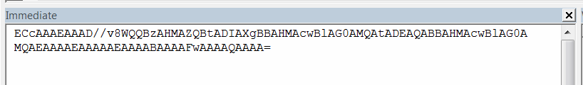

SOLIDWORKS API中提供的持久引用ID允许检索SOLIDWORKS中任何可选择对象的持久链接。持久引用的主要优点是其生命周期，因为引用在重建操作、SOLIDWORKS会话甚至SOLIDWORKS版本之间保持有效。

持久引用ID是一个字节数组。对于相同的引用，该数组可能会发生变化，因此无法通过比较两个数组来确定引用是否相同。使用[IModelDocExtension::IsSamePersistentID方法](https://help.solidworks.com/2017/english/api/sldworksapi/solidworks.interop.sldworks~solidworks.interop.sldworks.imodeldocextension~issamepersistentid.html)来确定两个持久引用是否相同。

{ width=350 }

即使对于相同的实体，数组可能会发生变化，仍然可以通过[SOLIDWORKS API方法IModelDocExtension::GetPersistReference3](https://help.solidworks.com/2017/english/api/sldworksapi/solidworks.interop.sldworks~solidworks.interop.sldworks.imodeldocextension~getpersistreference3.html)检索到实体的有效指针。

以下示例将任何选定实体的持久ID以base64字符串的格式输出到即时窗口中。

使用此示例来读取实体的ID。

> 输出到即时窗口的ID可能包含换行符。应将其从ID中删除，并将其视为单行字符串。



以下示例允许通过从持久ID中检索其指针来选择对象。

* 复制上一个宏中的ID
* 关闭示例模型
* 重新打开模型并运行示例。
* 将复制的ID输入到框中
* 重新选择在前一个示例中选择的实体

